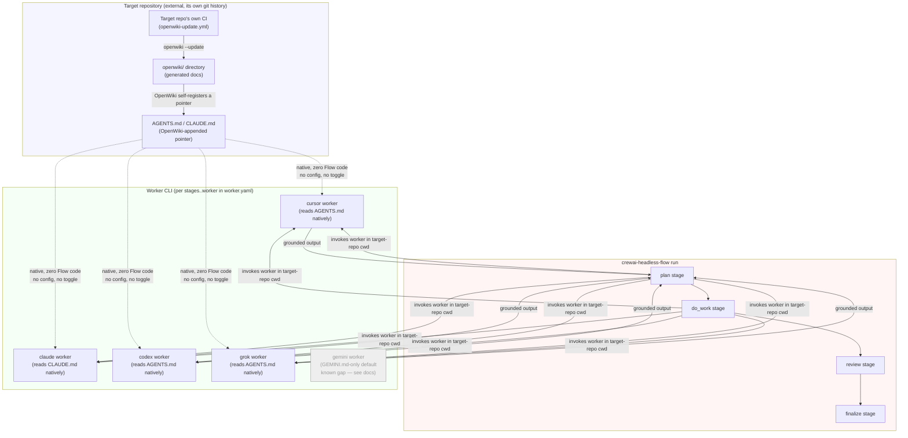

# Domain Model Integration

**Goal:** Give the Flow's stages durable, cross-run grounding in each target repository's own domain vocabulary/architecture — by relying on [OpenWiki](https://github.com/langchain-ai/openwiki) (`openwiki/` + its `AGENTS.md`/`CLAUDE.md` self-registration) when a target repo already has it, without disturbing the existing skill/worker/HITL architecture.

**Not "the wiki," and not `domain-modeling`-skill-based:** an earlier version of this design reused this project's own vendored `domain-modeling` skill (`CONTEXT.md`/`docs/adr/`, Flow-authored). That approach is superseded — see `docs/adr/0001-canonical-adr-location-for-domain-model-integration.md` (status: superseded) and `docs/adr/0002-openwiki-replaces-domain-modeling-for-target-repo-context.md`.

---

## Resolved Design

- **Maintenance is entirely external.** The Flow never invokes `openwiki` itself (not in `finalize`, not as a new pseudo-stage). OpenWiki ships its own CI-driven update loop (`openwiki-update.yml` for GitHub/GitLab) as its intended staleness-management mechanism; duplicating that inside `crewai-headless-flow` would just create two independent things trying to keep `openwiki/` current.
- **No new file-format handling.** OpenWiki's own documented behavior is to append a pointer into the target repo's `AGENTS.md`/`CLAUDE.md` instructing agents to reference `openwiki/`. The Flow does not parse or guess OpenWiki's internal `openwiki/` directory structure — it just benefits from whatever pointer OpenWiki already wrote into files the workers already read.
- **This may require zero new Flow code for the workers that already read those files natively:**
  - `codex`: reads `AGENTS.md` natively (root→cwd walk, no config). **Confirmed for v1** (2026-07-07): a live `codex exec --cd <dir> --sandbox read-only --skip-git-repo-check --ephemeral --json` run — the exact flags `CodexAdapter` uses for inspect mode, routed via `--oss --local-provider ollama` to sidestep this sandbox's ChatGPT-account model restriction — correctly read and quoted a unique marker string from a test `AGENTS.md`.
  - `cursor`: reads `AGENTS.md` natively, auto-discovered, no config needed. **Confirmed for v1.**
  - `claude`: reads `CLAUDE.md` natively; OpenWiki writes to both `AGENTS.md` and `CLAUDE.md`, so this is covered regardless of Claude Code's own `AGENTS.md` support. **Confirmed for v1.**
  - `gemini`: defaults to `GEMINI.md` only; `AGENTS.md` support requires the *target repo's own* `.gemini/settings.json` to set `context.fileName` to include `AGENTS.md` — not on by default, and OpenWiki doesn't write `GEMINI.md`. **Real gap — resolved via documentation** (see Fast-Follow #2 below).
  - `grok`: this project shells out to the `grok` binary (`workers/grok.py`, "Grok Build CLI"). **Confirmed** (2026-07-07): `grok inspect --json` (a config-discovery command, no LLM call, no billing) run against a test directory lists its `AGENTS.md` under `projectInstructions` with `fileType: "agents_md"` — the binary genuinely discovers and would include it as project context.
- **v1 worker scope: `cursor`, `claude`, `codex`, and `grok` — all four confirmed.** Ship documentation-only support (see below) for these four; `gemini` is resolved as a documented target-repo-config requirement, not a code path.
- **v1 is documentation-only — no code, no config, no tests.** Add a section to `README.md`/`DESIGN.md`: "If your target repo uses OpenWiki, the `cursor`, `claude`, `codex`, and `grok` workers already pick up its `AGENTS.md`/`CLAUDE.md` pointer natively — no `crewai-headless-flow` configuration needed." No `worker.yaml` toggle, no CLI override flag, no new Flow-side read/write logic.
- **Explicit non-goals carried over from the earlier design pass:** no Flow-authored `CONTEXT.md`/`docs/adr/` writing, no multi-context repo handling, no HITL gate, no run-history/working-notes content — none of that applies now that maintenance is fully external to OpenWiki.

## Fast-Follow Work — all items resolved (2026-07-07)

1. ~~Empirically verify `codex` actually honors `AGENTS.md`~~ — **Confirmed.** Initial attempts with this sandbox's default ChatGPT-account auth failed for every model (`gpt-5.4`, `gpt-5`, `gpt-5-codex`, `gpt-5.1`, `gpt-5.1-codex`, `gpt-4.1`, `o3`, `o4-mini`, `gpt-5-mini`) with `The '<model>' model is not supported when using Codex with a ChatGPT account` (HTTP 400) — an account/auth restriction, not an `AGENTS.md` problem. Routing the same real invocation shape through `--oss --local-provider ollama --model qwen2.5-coder` bypassed that restriction entirely: the run (exit 0) responded with the exact marker string from the test `AGENTS.md`, confirming the CLI's native `AGENTS.md` support empirically, not just per upstream docs.
2. **Resolved** — the `gemini` gap is real (Gemini CLI defaults to `GEMINI.md` only; OpenWiki doesn't write `GEMINI.md`) and is handled via documentation only: operators must add `AGENTS.md` to the target repo's own `.gemini/settings.json` `context.fileName`. No Flow-side code. Written into `README.md`/`DESIGN.md`.
3. ~~Verify what `grok` (the actual `workers/grok.py` binary) does with `AGENTS.md`~~ — **Confirmed.** Initial attempts to run a live turn hit `402 Payment Required` / `personal-team-blocked:spending-limit` — a billing state, not an `AGENTS.md` problem. `grok inspect --json`, a config-discovery subcommand that makes no LLM call and isn't billed, confirmed the binary lists a test directory's `AGENTS.md` under `projectInstructions` (`fileType: "agents_md"`) — genuine native discovery.
4. **Resolved as "no code needed."** All four non-gemini workers (`cursor`, `claude`, `codex`, `grok`) are now empirically or previously confirmed to honor `AGENTS.md`/`CLAUDE.md` natively. `gemini`'s gap is handled via target-repo documentation (#2). No Flow-side safety net is warranted.

## Superseded Design (for history — do not implement)

The original design (Q1-Q16 of this session) proposed:
- `plan` reads target-repo `CONTEXT.md` (Flow-injected), `finalize` writes `CONTEXT.md`/`docs/adr/` (agent-driven), using the `domain-modeling` skill's conventions.
- A `docs/adr/` vs `docs/decisions/` conflict with the vendored `documentation-and-adrs` skill, resolved via a prompt-level addendum rather than a skill swap.
- A `domain_model: { enabled: false }` block in `worker.yaml` plus a `--override-domain-model` CLI flag.
- Config-time validation limited to shape (`enabled` must be a bool); target-repo filesystem state handled as a runtime no-op.

All of this is superseded by the OpenWiki-based, documentation-only approach above. Kept here rather than deleted, per this project's own ADR-lifecycle rule: don't delete old context, record that it changed and why.

## Flow Diagram

**Reading the diagram:** the top box is entirely outside `crewai-headless-flow` — OpenWiki and its CI loop live in, and are maintained by, the target repository itself. The Flow (middle box) never talks to OpenWiki directly; it just runs its normal stages against the target repo as it always has. The only place OpenWiki's output actually reaches an agent is inside the worker CLI's own native context-file discovery (bottom box), for whichever stage happens to invoke `cursor`/`claude`/`codex`/`grok` against that target repo's working directory — `crewai-headless-flow` contributes zero code, config, or awareness to this path. `gemini` is greyed out because its `GEMINI.md`-only default means it needs a target-repo config change to participate (see the worker table above).

## Related

- `docs/adr/0001-canonical-adr-location-for-domain-model-integration.md` (superseded)
- `docs/adr/0002-openwiki-replaces-domain-modeling-for-target-repo-context.md`
- `CONTEXT.md` — `Domain Model Integration` and `Target-repo domain model` glossary entries (already reflect this OpenWiki-based revision).
- `docs/plans/2026-07-06-hitl-dmi-convergence.md` — how this feature relates to Conditional HITL. Note: `CONTEXT.md` and `docs/adr/` are **shared** with the Conditional HITL Phase 0 work, which will *append* to them (Gate/Trigger glossary entries, a new ADR-0003), not recreate them.
- [OpenWiki](https://github.com/langchain-ai/openwiki)
